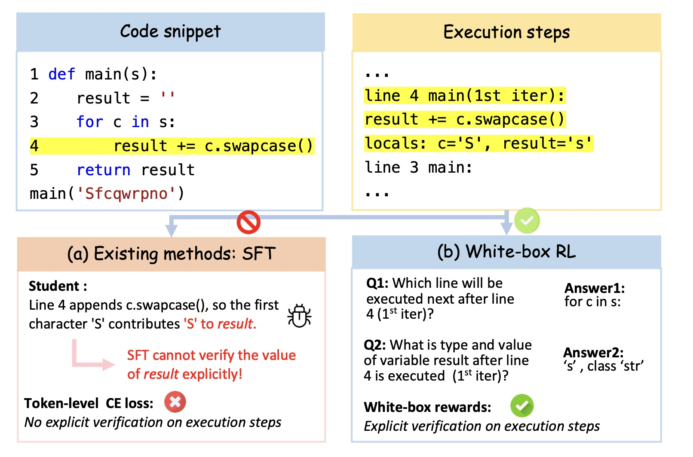

## ExecVerify

### Core Idea

Existing approaches optimize the cross-entropy loss over the entire sequence without explicitly verifying execution details such as variable values or control flow.

In contrast, white-box RL leverages interpreter-provided execution steps to assign verifiable, step-level rewards.


<a href="figs/assets_overview.jpg">
  
</a>


### Approach Overview

- **Constraint-based Data Synthesis**
  - Generate Python code with structural constraints (e.g., control structures, method calls).
  - Synthesize diverse inputs.
  - Filter samples by executability and difficulty.

- **Two-Stage Post-Training**
  - **Stage I (Execution Reasoning):** Apply white-box RL using interpreter-trace-derived, step-level rewards.
  - **Stage II (Code Generation):** Transfer improvements to code generation using unit-test rewards.


### Performance Summary (High Level)

- **Execution reasoning:** average score improves from 60.8 to 80.8 (+20.0) and is competitive with Qwen2.5-Coder-32B-Instruct (77.9).
- **Code generation:** yields up to +5.9 pass@1 over strong post-training baselines.


### Open-Source Releases

- **Datasets**
  - **SFT dataset:** 🤗[HF Link](https://huggingface.co/datasets/justForAnonymous/sft_dataset)
  - **RL dataset:** 🤗[HF Link](https://huggingface.co/datasets/justForAnonymous/rl_dataset)

- **Models**
  - **Stage I model (white-box RL for execution reasoning):** 🤗[HF Link](https://huggingface.co/justForAnonymous/stage1)
  - **Stage II model (unit-test RL for code generation):** 🤗[HF Link](https://huggingface.co/justForAnonymous/stage2)


### Repo Structure (Quick Navigation)

- **`data/`**: Full implementation of constraint-based data synthesis. This includes code for generating structural constraints, synthesizing diverse inputs, and filtering by executability and difficulty. See [`data/README.md`](data/README.md) for details.
- **`train/`**: SFT warm-up and two-stage post-training code and scripts, including how to launch training runs, configs, and example scripts. See [`train/README.md`](train/README.md) for details.
- **`evaluation/`**: Scripts for evaluating ExecVerify models (e.g., CRUXEval, LiveCodeBench, etc.). See [`evaluation/README.md`](evaluation/README.md) for details.

### Quickstart

1) Install dependencies:

```bash
pip install -r requirements.txt
```

2) Download a checkpoint (recommended: **Stage II** model for code generation + unit-test RL):

- **Stage II model:** 🤗[HF Link](https://huggingface.co/justForAnonymous/stage2)

~~~python
from vllm import LLM, SamplingParams
from transformers import AutoTokenizer

model_path = "path/to/your/model"

prompt_str = """from typing import List

def has_close_elements(numbers: List[float], threshold: float) -> bool:
    \"\"\"Check if in given list of numbers, are any two numbers closer to each other than
    the given threshold.
    >>> has_close_elements([1.0, 2.0, 3.0], 0.5)
    False
    >>> has_close_elements([1.0, 2.8, 3.0, 4.0, 5.0, 2.0], 0.3)
    True
    \"\"\"
"""

user_input = f"""
Your task is to complete the provided function.
{prompt_str}

Verify your generated function using the provided inputs.

Output format:
<reasoning>
Your step-by-step reasoning.
</reasoning>
<answer>
```python
The generated function.
```
</answer>
"""

tokenizer = AutoTokenizer.from_pretrained(model_path, trust_remote_code=True)
chat_message = [
    {"role": "user", "content": user_input},
]

formatted_prompt = tokenizer.apply_chat_template(
    chat_message,
    tokenize=False,
    add_generation_prompt=True,
)

llm = LLM(
    model=model_path,
    trust_remote_code=True,
    max_model_len=16384,
    gpu_memory_utilization=0.9,
    tensor_parallel_size=1,
)

sampling_params = SamplingParams(
    temperature=0.0,
    top_p=1.0,
    top_k=-1,
    max_tokens=4096,
    repetition_penalty=1.0,
)

outputs = llm.generate([formatted_prompt], sampling_params)
raw_output = outputs[0].outputs[0].text

if "<answer>" in raw_output and "</answer>" in raw_output:
    answer_part = raw_output.split("<answer>")[-1].split("</answer>")[0]
    print("\nExtracted Answer:")
    print(answer_part)
~~~